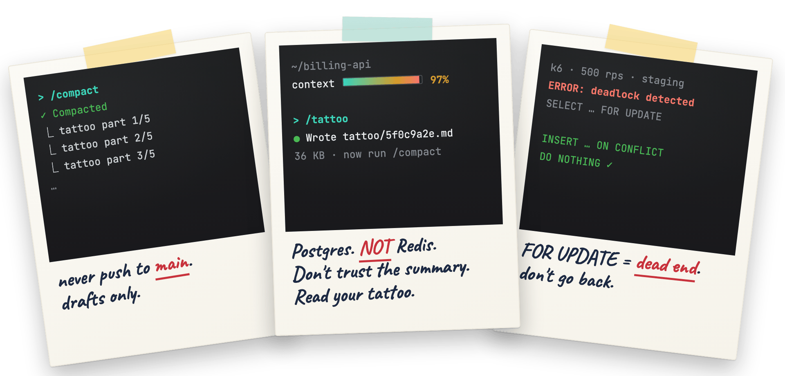
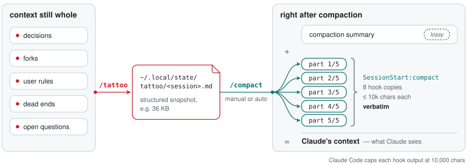

# tattoo

<p align="center">
  
</p>

**Claude теряет память на каждом `/compact`. Набейте главное заранее.**

[English version](README.md)

В «Мементо» память Леонарда обнуляется каждые несколько минут. Он спасается
татуировками и полароидами: перед обнулением записывает главное, а после —
читает записанное.

У Claude Code тот же диагноз. Когда контекст заполняется, `/compact` (или
автосжатие) заменяет разговор сводкой. Сводка сохраняет, *что* произошло, но
теряет *почему*: отвергнутые варианты и причины, правило, которое вы задали два
часа назад, тупик, в который вы уже упирались. После сжатия Claude предлагает
тот самый подход, от которого вы отказались час назад.

`tattoo` решает это тремя небольшими частями:

1. **`/tattoo`** — скилл, по которому Claude записывает структурированный снимок
   сессии в `~/.local/state/tattoo/<session-id>.md`, *пока контекст ещё цел*.
2. **Хук `SessionStart` с matcher `compact`** — сразу после каждого сжатия,
   ручного или автоматического, дословно возвращает этот файл в контекст.
3. **Compact instructions** (по желанию) — блок в `CLAUDE.md`, благодаря
   которому сама сводка сжатия сохраняет развилки и решения и не дублирует
   татуировку.

Никакого MCP-сервера, базы данных и демона: один Markdown-файл на сессию и два
маленьких bash-скрипта.

<picture>
  <source media="(prefers-color-scheme: dark)" srcset="assets/how-it-works-dark.svg">
  
</picture>

## Как выглядит татуировка

```markdown
# Tattoo · billing-api · 2026-09-14 16:20 · ветка feat/idempotency
Добавляем ключи идемпотентности в POST /charges: повторы запросов клиента списывали деньги дважды.

## История
1. Воспроизвели двойное списание: повтор после 504 даёт две строки в `charges`. На staging.
2. Таблица `idempotency_keys` + middleware: коммит a1c9e02, запушено, draft PR #412.
3. Нагрузочный тест: p99 +3 мс (k6, 500 rps, staging, 2026-09-14).

## Развилки и решения
- Хранилище ключей: Redis или Postgres. Пользователь: «без новой инфраструктуры, Postgres». Redis отвергнут: его единственный плюс — TTL.
- Область ключа: в пределах аккаунта, не глобально. Claude: так нет коллизий между тенантами.
- Отвергнуто: хеш тела запроса как ключ; ломает законные повторы с тем же payload.

## Проблемы
- Middleware срабатывал после парсера тела, ключ был undefined. Решение: подключили до `express.json()`.
- Тупик: `SELECT ... FOR UPDATE` ловил дедлоки под k6. Заменили на `INSERT ... ON CONFLICT DO NOTHING`.

## Знания
- Интеграционные тесты: `pnpm test:int` (нужен `docker compose up db`).
- Миграции лежат в `db/migrations/`, запуск — `pnpm migrate`.

## Правила пользователя
- Никогда не пушить в main; PR — только черновиками.
- `legacy/` не трогать без спроса.

## Открыто
- Спросили пользователя: «TTL ключа: 24 ч или 7 дней?» Ответа пока нет.
- Дальше: джоба, которая удаляет устаревшие ключи.

## Где подробности
- Транскрипт: ~/.claude/projects/-home-me-billing-api/5f0c….jsonl, искать «повтор после 504».
```

## Установка

### Вариант A: плагин (рекомендуется)

Внутри Claude Code:

```text
/plugin marketplace add nchuguevskiy/tattoo
/plugin install tattoo@tattoo
```

Или из терминала:

```bash
claude plugin marketplace add nchuguevskiy/tattoo
claude plugin install tattoo@tattoo
```

Перезапустите Claude Code. Скилл появится как `/tattoo` (полное имя
`/tattoo:tattoo`), а плагин зарегистрирует хук.

Плагин ставит английскую версию скилла, но татуировку скилл всё равно пишет на
языке пользователя; если нужен скилл с русским текстом, используйте вариант B с
`--lang ru`.

### Вариант B: ручная установка без системы плагинов

```bash
git clone https://github.com/nchuguevskiy/tattoo.git
cd tattoo
./install.sh                          # английский скилл
./install.sh --lang ru                # русский скилл
./install.sh --compact-instructions   # ещё и дописать Compact instructions в ~/.claude/CLAUDE.md
```

Скрипт копирует скилл в `~/.claude/skills/tattoo/`, хук — в
`~/.claude/hooks/tattoo-restore.sh` и добавляет в `~/.claude/settings.json`
группу хуков `SessionStart` с matcher `compact`. Существующие настройки
сохраняются, рядом с файлом кладётся резервная копия, повторный запуск
безопасен. `CLAUDE_CONFIG_DIR` учитывается.

### Шаг 3 (рекомендуется): Compact instructions

Плагин не может править ваш `CLAUDE.md`, так что блок придётся добавить
самостоятельно. При сжатии
[Claude Code читает раздел `# Compact instructions`](https://code.claude.com/docs/en/costs#manage-context-proactively)
из `CLAUDE.md`:

```bash
curl -fsSL https://raw.githubusercontent.com/nchuguevskiy/tattoo/main/i18n/ru/compact-instructions.md >> ~/.claude/CLAUDE.md
```

Это русский шаблон, `i18n/ru/compact-instructions.md`; английский лежит в
`templates/compact-instructions.md`. В варианте B то же самое делает флаг
`--compact-instructions` (вместе с `--lang ru` он добавляет русский шаблон).

### Проверка

- `/hooks` показывает восемь хуков `SessionStart` с matcher `compact` (почему
  их восемь — см. [Большие татуировки](#большие-татуировки)).
- Выполните `/tattoo`, затем `/compact`, затем спросите Claude: «что написано
  в твоей татуировке о наших решениях?»

Требования: Claude Code с поддержкой плагинов и хуков, `bash`, а также `jq` или
`python3` (если нет ни того, ни другого, хук обходится `sed`). Проверено на
macOS; на Linux должно работать; на Windows используйте WSL или Git Bash (не
проверялось).

## Использование

```text
/tattoo                              снимок сессии
/tattoo next: the payments migration   то же, но с фокусом на следующий этап
/compact
```

- **Когда запускать:** примерно при 60–80% заполнения контекста, перед
  переходом к новому этапу работы или когда принято много решений.
  Автосжатие тоже запускает хук, так что он восстановит последнюю татуировку,
  когда бы вы её ни сделали.
- **Татуировки растут от сжатия к сжатию.** Новый `/tattoo` сначала читает
  старую татуировку и переносит всё, что ещё верно, поэтому и после трёх
  сжатий она охватывает всю сессию. А третья сводка сжатия — это сводка
  сводки сводки.
- **Одна татуировка на сессию.** `/clear` начинает новую сессию, у которой
  татуировки нет. `--resume` сохраняет id сессии, так что татуировка остаётся
  в силе.
- **Хук сообщает возраст татуировки.** Всё, что произошло после неё, есть
  только в сводке, и хук велит Claude доверять сводке там, где они расходятся.

## Большие татуировки

Claude Code заменяет вывод любого отдельного хука длиннее 10 000 символов
превью на 2 КБ и путём к файлу. Лимит действует на каждый хук отдельно и не
настраивается (замерено на Claude Code 2.1.273). Подробная татуировка часто
занимает 20–60 КБ, так что один хук доставил бы только её первые 2 КБ.

Это не теория. В двух реальных сессиях с предрелизной версией, где хук был
один, все 13 сжатий упёрлись в лимит (снимки на 13–62 тыс. символов). Только
после 6 из них Claude первым делом прочитал файл целиком; после остальных он
десятки и сотни шагов работал по превью на 2 КБ.

Чтобы обойти это, tattoo регистрирует 8 копий хука. Каждая копия выводит одну
часть татуировки: не больше 8500 символов, с разрезом по границам строк и
пометкой `part i/N`. Вместе они дословно доставляют до ~68 000 символов
(около 17 тыс. токенов английского текста). Копии выполняются параллельно,
поэтому части могут прийти не по порядку; первая часть велит Claude читать их
по номерам.

- Если татуировке нужно больше восьми частей, первая часть велит Claude, прежде
  чем продолжать, прочитать (Read) остаток файла с указанной строки.
- Если будущая версия Claude Code изменит лимит и часть придёт как
  «Output too large», тот же заголовок велит Claude прочитать (Read) файл
  целиком.
- `tests/e2e.sh` проверяет это от начала до конца: сжимает сессию с
  татуировкой на 32 КБ и просит Claude с отключёнными инструментами назвать
  кодовое слово из последней строки.

`TATTOO_PART_SIZE` (по умолчанию `8500`) задаёт размер части.

## Настройка

| Переменная   | По умолчанию              | Назначение |
|--------------|---------------------------|------------|
| `TATTOO_DIR` | `$XDG_STATE_HOME/tattoo`, иначе `~/.local/state/tattoo` | Где хранятся татуировки. Задайте её в shell или в блоке `env` файла `settings.json`, чтобы её видели и хук, и скилл. |
| `TATTOO_PART_SIZE` | `8500` | Максимум символов в одной части вывода хука. Держите ниже 10 000 минус примерно 1000 на заголовок. |
| `CLAUDE_CONFIG_DIR` | `~/.claude` | Куда `install.sh` кладёт скилл, хук и запись в настройках. |

**Почему не `~/.claude/tattoos`?** Claude Code считает `.claude`
[защищённым путём](https://code.claude.com/docs/en/permission-modes#protected-paths):
каждая запись туда требует подтверждения, и правила allow не могут одобрить её
заранее. Скилл заранее разрешает запись в `~/.local/state/tattoo/`, поэтому
`/tattoo` работает без запросов. Если направить `TATTOO_DIR` в другое место,
Claude будет спрашивать разрешение перед записью туда, пока вы не добавите в
настройки правило allow вроде `Edit(//path/to/tattoos/**)`.

## Частые вопросы

**Почему не просто `/compact focus on X` или только Compact instructions?**
Сводку пишет модель в момент сжатия, стараясь быть краткой, и при каждом
сжатии она переписывается заново. Татуировку пишут намеренно, заранее, по
полному контексту, и возвращается она слово в слово. Используйте оба способа:
Compact instructions улучшают сводку, а татуировка сохраняет то, что сводка
всё равно теряет.

**Почему не `CLAUDE.md` или память?**
Там хранятся факты, которые должны пережить сессию. Татуировка хранит рабочее
состояние *этой* сессии: развилку, на которой вы стоите, вопрос, ответа на
который ждёте, тупик часовой давности. Если что-то уже есть в `CLAUDE.md` или
в памяти, татуировка ссылается на это по пути, а не копирует.

**Почему не писать её автоматически в хуке `PreCompact`?**
Хук `PreCompact` не может ни добавить контекст, ни заблокировать сжатие, а
shell-скрипт не напишет хорошую сводку разговора, которого не видит. Хорошей
татуировке нужны модель и весь контекст, поэтому её пишут командой, которую
запускаете вы.

**А секреты?**
Скилл запрещает Claude записывать секреты, токены и пароли. Татуировки — это
обычные файлы в вашем домашнем каталоге; удалить их можно командой
`rm -rf ~/.local/state/tattoo`. Хук читает только файл, имя которого совпадает
с id сессии, и игнорирует любой id, в котором есть что-то кроме букв, цифр и
дефисов.

**Как посмотреть, что получил Claude?**
Вывод хука сохраняется в транскрипте сессии
(`~/.claude/projects/<project>/<session-id>.jsonl`) как вложение (attachment)
сразу после сжатия.

## Разработка

```bash
tests/test.sh      # офлайн: запасные варианты разбора, разбиение (awk, gawk, mawk), install/uninstall на временном HOME
tests/e2e.sh       # настоящий Claude Code (haiku): /tattoo, /compact, проверка памяти; тратит несколько центов
claude plugin validate .
assets/build.sh    # перерисовать assets/hero.png и assets/social-preview.png (headless Chrome)
```

## Удаление

- Плагин: `/plugin uninstall tattoo@tattoo`, затем при желании
  `/plugin marketplace remove tattoo`.
- Ручная установка: `./uninstall.sh`.

Татуировки остаются в `~/.local/state/tattoo`, пока вы их не удалите. Если вы
добавляли Compact instructions в `CLAUDE.md`, удалите этот блок вручную.

## Благодарности

Идея взята из фильма «Мементо» (2000). Сжатый стиль записи вдохновлён
[caveman](https://github.com/JuliusBrussee/caveman).

## Лицензия

MIT
